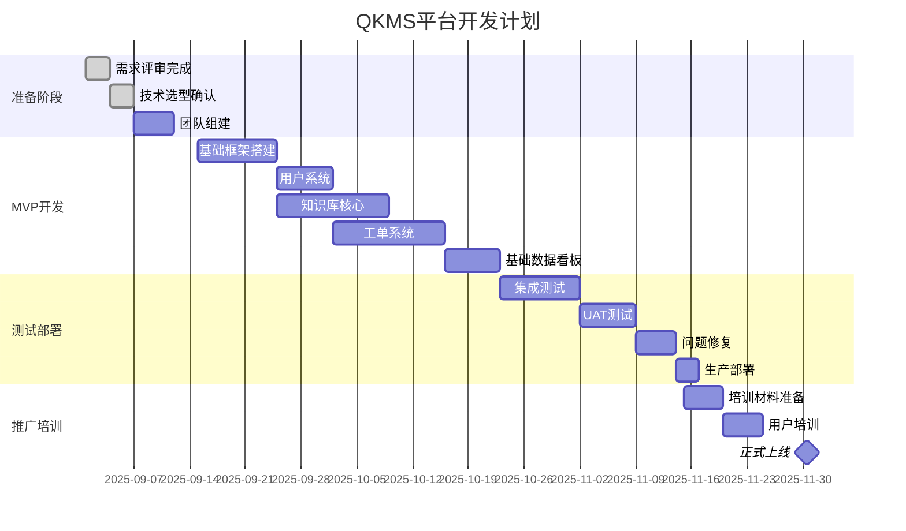

# 产品需求文档 (PRD): 昆泰芯微3D霍尔传感器市场赋能与情报平台

**文档版本:** V3.0 (改进版)  
**创建日期:** 2025年8月30日  
**文档状态:** 技术评审中  
**产品负责人:** [姓名]  
**技术负责人:** [姓名]  
**文档评审人:** [CTO/技术VP]

---

## 1. 产品概述

### 1.1 产品定位
昆泰芯微3D霍尔传感器市场赋能平台（代号：QKMS-Platform）是一个面向技术销售团队的综合业务支撑系统，通过知识管理、智能工具和数据分析三大能力，提升团队专业服务能力和市场响应速度。

### 1.2 产品架构概览
```
┌─────────────────────────────────────────────────────┐
│                    前端应用层                         │
│  ┌──────────┐ ┌──────────┐ ┌──────────┐ ┌────────┐ │
│  │ Web端    │ │ 移动端H5  │ │ 企业微信  │ │ API    │ │
│  └──────────┘ └──────────┘ └──────────┘ └────────┘ │
├─────────────────────────────────────────────────────┤
│                    业务服务层                         │
│  ┌──────────┐ ┌──────────┐ ┌──────────┐ ┌────────┐ │
│  │知识管理  │ │工单系统   │ │设计工具   │ │数据分析│ │
│  └──────────┘ └──────────┘ └──────────┘ └────────┘ │
├─────────────────────────────────────────────────────┤
│                    基础服务层                         │
│  ┌──────────┐ ┌──────────┐ ┌──────────┐ ┌────────┐ │
│  │用户认证  │ │权限管理   │ │消息通知   │ │文件存储│ │
│  └──────────┘ └──────────┘ └──────────┘ └────────┘ │
├─────────────────────────────────────────────────────┤
│                    数据持久层                         │
│  ┌──────────┐ ┌──────────┐ ┌──────────┐ ┌────────┐ │
│  │PostgreSQL│ │ Redis    │ │ MinIO    │ │ElasticS│ │
│  └──────────┘ └──────────┘ └──────────┘ └────────┘ │
└─────────────────────────────────────────────────────┘
```

### 1.3 技术选型

| 层级 | 技术选择 | 选择理由 |
|------|---------|----------|
| 前端 | React 18 + TypeScript + Ant Design | 成熟生态、组件丰富、团队熟悉 |
| 移动端 | PWA + Responsive Design | 开发成本低、离线能力强 |
| 后端 | Node.js(Express) + Python(FastAPI) | JS处理业务逻辑、Python做数据分析 |
| 数据库 | PostgreSQL + Redis | 关系型数据+缓存，成熟稳定 |
| 搜索引擎 | Elasticsearch | 全文搜索、知识库检索 |
| 文件存储 | MinIO | 私有化部署、S3兼容 |
| 部署 | Docker + Kubernetes | 容器化部署、便于扩展 |
| 监控 | Prometheus + Grafana | 开源方案、功能完善 |

---

## 2. 用户角色与权限设计

### 2.1 用户角色定义

| 角色 | 权限范围 | 典型用户 | 预计数量 |
|------|---------|---------|----------|
| 超级管理员 | 系统所有功能的完全控制权 | IT管理员 | 2-3人 |
| 内容管理员 | 知识库管理、方案审核、数据维护 | 产品经理 | 3-5人 |
| 高级用户 | 创建和编辑内容、使用所有工具、查看所有数据 | 资深FAE、研发 | 10-15人 |
| 普通用户 | 查看内容、创建工单、使用基础工具 | 初级FAE、销售 | 30-40人 |
| 访客 | 仅查看公开内容 | 合作伙伴 | 不限 |

### 2.2 权限矩阵

| 功能模块 | 超管 | 内容管理 | 高级用户 | 普通用户 | 访客 |
|---------|------|---------|---------|---------|------|
| 系统配置 | ✓ | - | - | - | - |
| 用户管理 | ✓ | - | - | - | - |
| 知识库-创建 | ✓ | ✓ | ✓ | - | - |
| 知识库-编辑 | ✓ | ✓ | 仅自己创建 | - | - |
| 知识库-查看 | ✓ | ✓ | ✓ | ✓ | 公开内容 |
| 工单-创建 | ✓ | ✓ | ✓ | ✓ | - |
| 工单-处理 | ✓ | ✓ | ✓ | - | - |
| 设计工具 | ✓ | ✓ | ✓ | ✓ | - |
| 数据看板 | ✓ | ✓ | ✓ | 基础数据 | - |
| 竞品情报 | ✓ | ✓ | ✓ | - | - |

---

## 3. 核心功能模块详细设计

### 3.1 知识管理模块

#### 3.1.1 功能架构
```
知识管理模块
├── 内容创作
│   ├── 富文本编辑器（支持Markdown）
│   ├── 模板管理（应用方案、故障排查、竞品分析）
│   └── 多媒体支持（图片、视频、附件）
├── 内容组织
│   ├── 多级分类体系
│   ├── 标签管理
│   └── 版本控制
├── 内容审核
│   ├── 审核工作流
│   ├── 质量评分
│   └── 专家认证
└── 内容检索
    ├── 全文搜索
    ├── 智能推荐
    └── 相似内容
```

#### 3.1.2 数据模型

```sql
-- 知识库文章表
CREATE TABLE articles (
    id UUID PRIMARY KEY,
    title VARCHAR(200) NOT NULL,
    content TEXT NOT NULL,
    category_id INTEGER REFERENCES categories(id),
    author_id INTEGER REFERENCES users(id),
    status ENUM('draft', 'reviewing', 'published', 'archived'),
    version INTEGER DEFAULT 1,
    view_count INTEGER DEFAULT 0,
    like_count INTEGER DEFAULT 0,
    quality_score DECIMAL(3,2),
    created_at TIMESTAMP,
    updated_at TIMESTAMP,
    published_at TIMESTAMP,
    metadata JSONB  -- 存储自定义字段
);

-- 文章标签关联表
CREATE TABLE article_tags (
    article_id UUID REFERENCES articles(id),
    tag_id INTEGER REFERENCES tags(id),
    PRIMARY KEY (article_id, tag_id)
);

-- 文章版本历史表
CREATE TABLE article_versions (
    id UUID PRIMARY KEY,
    article_id UUID REFERENCES articles(id),
    version INTEGER NOT NULL,
    content TEXT NOT NULL,
    change_log TEXT,
    author_id INTEGER REFERENCES users(id),
    created_at TIMESTAMP
);
```

#### 3.1.3 关键业务流程

**内容发布流程：**
```
创建草稿 → 内容编辑 → 提交审核 → 技术评审 → 修改完善 → 正式发布 → 效果跟踪
```

**质量控制机制：**
- 模板规范：强制使用标准模板，确保内容完整性
- Peer Review：高级用户互评机制
- 用户反馈：阅读者评分和评论
- 定期审查：每季度复查高频访问内容

### 3.2 工单管理模块

#### 3.2.1 工单生命周期
```
新建(New) → 分配(Assigned) → 处理中(In Progress) → 待验证(Pending) → 已解决(Resolved) → 已关闭(Closed)
                                            ↓
                                     重新打开(Reopened)
```

#### 3.2.2 智能辅助功能

**相似问题推荐算法：**
```python
def find_similar_tickets(new_ticket_text, threshold=0.7):
    """
    基于TF-IDF和余弦相似度查找相似工单
    """
    # 1. 对新工单进行分词和向量化
    new_vector = tfidf_vectorizer.transform([new_ticket_text])
    
    # 2. 计算与历史工单的相似度
    similarities = cosine_similarity(new_vector, historical_vectors)
    
    # 3. 返回相似度超过阈值的工单
    similar_tickets = []
    for idx, score in enumerate(similarities[0]):
        if score > threshold:
            similar_tickets.append({
                'ticket_id': historical_tickets[idx].id,
                'title': historical_tickets[idx].title,
                'solution': historical_tickets[idx].solution,
                'similarity_score': score
            })
    
    return sorted(similar_tickets, key=lambda x: x['similarity_score'], reverse=True)[:5]
```

#### 3.2.3 SLA管理规则

| 问题级别 | 响应时间 | 解决时间 | 升级规则 |
|---------|---------|---------|----------|
| P0-紧急 | 1小时 | 4小时 | 超时自动升级到上级主管 |
| P1-高 | 2小时 | 24小时 | 超时邮件提醒 |
| P2-中 | 8小时 | 3天 | 每日提醒 |
| P3-低 | 24小时 | 7天 | 周度汇总 |

### 3.3 设计工具模块（磁路设计助手）

#### 3.3.1 功能设计理念
鉴于完整的磁路仿真技术门槛高，我们采用**"规则校验+参考设计"**的务实方案：

**核心功能：**
1. **参数化设计向导**
   - 应用场景选择（摇杆/旋钮/滑块等）
   - 磁铁规格输入（材料/尺寸/充磁方向）
   - 传感器选型（根据参数自动推荐）
   - 安装位置建议（基于经验规则）

2. **设计规则校验**
   ```javascript
   const designRules = [
     {
       name: "磁场强度检查",
       check: (params) => {
         const fieldStrength = calculateFieldStrength(params);
         return fieldStrength >= sensor.minField && fieldStrength <= sensor.maxField;
       },
       message: "磁场强度应在20-70mT范围内"
     },
     {
       name: "线性度评估",
       check: (params) => {
         const linearityError = estimateLinearity(params);
         return linearityError < 0.05; // 5%以内
       },
       message: "预估线性度误差超过5%，建议调整磁铁位置"
     }
   ];
   ```

3. **参考设计库**
   - 预置10+个验证过的标准设计
   - 包含CAD图纸、BOM清单、测试数据
   - 支持参数微调和下载

#### 3.3.2 技术实现方案
```
前端可视化：Three.js 3D展示 + D3.js 数据图表
计算引擎：基于经验公式的快速估算（非仿真）
数据存储：设计参数JSON + 文件附件
```

### 3.4 数据分析模块

#### 3.4.1 数据采集架构
```
数据源
├── 用户行为数据
│   ├── 页面访问日志（通过前端埋点）
│   ├── 功能使用记录
│   └── 搜索关键词
├── 业务数据
│   ├── 工单信息
│   ├── 知识库内容
│   └── 设计方案
└── 外部数据（V2.0）
    ├── CRM客户信息
    ├── ERP订单数据
    └── 竞品公开信息
```

#### 3.4.2 核心指标体系

**实时指标（Redis缓存，每5分钟更新）：**
- 当前在线用户数
- 今日新增工单数
- 待处理工单数
- 知识库访问TOP10

**日度指标（PostgreSQL计算，凌晨2点更新）：**
- DAU/MAU
- 工单解决率
- 平均响应时间
- 知识库贡献度排行

**月度指标（Python分析脚本，月初生成）：**
- 问题类型分布分析
- 产品型号问题热力图
- 客户价值分析
- 功能需求优先级矩阵

#### 3.4.3 智能分析功能

**问题预警机制：**
```python
def detect_quality_issues():
    """
    基于问题聚类分析，自动发现产品质量风险
    """
    recent_tickets = get_tickets_last_30_days()
    
    # 按产品型号和问题类型聚合
    issue_clusters = {}
    for ticket in recent_tickets:
        key = (ticket.product_model, ticket.issue_type)
        if key not in issue_clusters:
            issue_clusters[key] = []
        issue_clusters[key].append(ticket)
    
    # 识别异常增长的问题组合
    alerts = []
    for key, tickets in issue_clusters.items():
        if len(tickets) > threshold and growth_rate(tickets) > 0.5:
            alerts.append({
                'product': key[0],
                'issue_type': key[1],
                'count': len(tickets),
                'growth_rate': growth_rate(tickets),
                'sample_tickets': tickets[:5]
            })
    
    return alerts
```

---

## 4. 数据安全与隐私保护

### 4.1 数据分级管理

| 数据级别 | 数据类型 | 访问控制 | 加密要求 |
|---------|---------|---------|----------|
| 机密 | 客户名单、价格信息、新产品规划 | 仅特定角色 | AES-256加密存储 |
| 敏感 | 技术方案、竞品分析、问题详情 | 登录用户 | 传输加密(HTTPS) |
| 内部 | 知识库文章、培训材料 | 员工可见 | 无特殊要求 |
| 公开 | 产品手册、应用笔记 | 任何人 | 无 |

### 4.2 安全措施

**技术安全：**
- JWT Token认证，有效期24小时
- API访问限流：每用户每分钟100次
- SQL注入防护：参数化查询
- XSS防护：内容过滤和CSP策略
- 敏感操作二次验证

**管理安全：**
- 最小权限原则
- 操作审计日志（保留90天）
- 定期安全评审（季度）
- 数据备份策略（每日增量、每周全量）

### 4.3 合规要求

- 遵守《数据安全法》相关规定
- 客户数据不出境
- 提供数据导出功能
- 账号注销后数据保留30天

---

## 5. 集成接口设计

### 5.1 第三方系统集成

| 系统 | 集成方式 | 数据流向 | 同步频率 | 优先级 |
|------|---------|---------|---------|--------|
| CRM(Salesforce) | REST API | 双向 | 实时 | P0 |
| 企业微信 | Webhook + API | 双向 | 实时 | P0 |
| ERP(SAP) | 数据库视图 | 单向读取 | 每日 | P1 |
| 邮件系统 | SMTP/IMAP | 双向 | 实时 | P1 |
| JIRA | REST API | 单向写入 | 实时 | P2 |

### 5.2 API设计规范

**RESTful API示例：**
```
# 工单相关API
POST   /api/v1/tickets          # 创建工单
GET    /api/v1/tickets          # 获取工单列表
GET    /api/v1/tickets/:id      # 获取工单详情
PUT    /api/v1/tickets/:id      # 更新工单
DELETE /api/v1/tickets/:id      # 删除工单

# 请求示例
POST /api/v1/tickets
Headers:
  Authorization: Bearer <token>
  Content-Type: application/json

Body:
{
  "title": "3D霍尔传感器在高温环境下输出漂移",
  "customer_id": "CUST_123456",
  "product_model": "QT3D-100",
  "priority": "P1",
  "description": "客户反馈...",
  "attachments": ["file_id_1", "file_id_2"]
}

# 响应示例
{
  "code": 200,
  "message": "success",
  "data": {
    "ticket_id": "TK_20250830_001",
    "status": "new",
    "created_at": "2025-08-30T10:30:00Z",
    "assigned_to": null,
    "estimated_resolution": "2025-08-31T10:30:00Z"
  }
}
```

### 5.3 Webhook通知机制

```javascript
// Webhook配置
const webhookConfig = {
  events: ['ticket.created', 'ticket.resolved', 'article.published'],
  endpoint: 'https://qpst.webhook.office.com/webhookb2/...',
  secret: process.env.WEBHOOK_SECRET,
  retryPolicy: {
    maxRetries: 3,
    backoffMultiplier: 2
  }
};

// 事件触发
async function triggerWebhook(event, data) {
  const payload = {
    event: event,
    timestamp: new Date().toISOString(),
    data: data
  };
  
  const signature = crypto
    .createHmac('sha256', webhookConfig.secret)
    .update(JSON.stringify(payload))
    .digest('hex');
  
  await axios.post(webhookConfig.endpoint, payload, {
    headers: {
      'X-Signature': signature
    }
  });
}
```

---

## 6. 性能与可扩展性设计

### 6.1 性能指标要求

| 指标 | 目标值 | 测量方法 |
|------|--------|----------|
| 页面加载时间 | < 2秒 (首屏) | Chrome DevTools |
| API响应时间 | < 200ms (P95) | APM监控 |
| 搜索响应时间 | < 500ms | Elasticsearch日志 |
| 并发用户数 | 支持200+ | 压力测试 |
| 系统可用性 | > 99.9% | 监控告警系统 |

### 6.2 优化策略

**前端优化：**
- 代码分割和懒加载
- 图片CDN加速
- Service Worker缓存
- 虚拟滚动列表

**后端优化：**
- Redis缓存热点数据
- 数据库索引优化
- 异步任务队列（Bull Queue）
- 读写分离

**架构优化：**
- 微服务架构预留
- 水平扩展能力
- 容器化部署
- 负载均衡

### 6.3 容量规划

| 资源 | 初始配置 | 扩展阈值 | 扩展方案 |
|------|---------|---------|----------|
| Web服务器 | 2核4G × 2 | CPU>70% | 增加实例 |
| 数据库 | 4核8G | 存储>70% | 升级配置 |
| Redis | 2G内存 | 内存>80% | 集群模式 |
| 文件存储 | 500GB | 使用>60% | 扩容 |

---

## 7. 测试策略

### 7.1 测试类型与覆盖

| 测试类型 | 覆盖范围 | 工具 | 通过标准 |
|---------|---------|------|----------|
| 单元测试 | 业务逻辑 | Jest/Pytest | 覆盖率>80% |
| 集成测试 | API接口 | Postman/Newman | 全部通过 |
| UI测试 | 关键流程 | Cypress | 主流程无错误 |
| 性能测试 | 并发和响应 | JMeter | 满足性能指标 |
| 安全测试 | 漏洞扫描 | OWASP ZAP | 无高危漏洞 |
| 兼容性测试 | 浏览器/设备 | BrowserStack | 主流环境正常 |

### 7.2 测试用例示例

```gherkin
Feature: 工单智能推荐
  作为一个FAE用户
  我希望在创建工单时获得相似问题推荐
  以便快速找到解决方案

  Scenario: 输入问题描述后获得推荐
    Given 我在创建工单页面
    When 我输入标题 "3D霍尔传感器输出跳动"
    And 我输入描述包含关键词 "温度" 和 "漂移"
    Then 系统应该推荐至少3个相关工单
    And 推荐结果应该包含解决方案链接
    And 相似度分数应该大于0.7
```

---

## 8. 部署与运维

### 8.1 部署架构

```yaml
# docker-compose.yml 示例
version: '3.8'
services:
  frontend:
    image: qkms-frontend:latest
    ports:
      - "80:80"
    environment:
      - API_URL=http://backend:3000
  
  backend:
    image: qkms-backend:latest
    ports:
      - "3000:3000"
    environment:
      - DB_HOST=postgres
      - REDIS_HOST=redis
    depends_on:
      - postgres
      - redis
  
  postgres:
    image: postgres:14
    volumes:
      - postgres_data:/var/lib/postgresql/data
    environment:
      - POSTGRES_DB=qkms
      - POSTGRES_PASSWORD=${DB_PASSWORD}
  
  redis:
    image: redis:7-alpine
    volumes:
      - redis_data:/data
```

### 8.2 监控告警

**监控指标：**
- 系统：CPU、内存、磁盘、网络
- 应用：QPS、响应时间、错误率
- 业务：活跃用户、工单处理、知识库访问

**告警规则：**
```javascript
const alertRules = [
  {
    name: 'API响应缓慢',
    condition: 'avg(response_time) > 1000ms for 5min',
    severity: 'warning',
    channels: ['email', 'wechat']
  },
  {
    name: '工单积压',
    condition: 'count(pending_tickets) > 50',
    severity: 'critical',
    channels: ['sms', 'phone']
  }
];
```

### 8.3 运维手册

**日常运维：**
- 日志轮转（每日）
- 数据备份检查（每日）
- 性能报告（每周）
- 安全扫描（每月）

**应急预案：**
- 服务降级策略
- 数据恢复流程
- 故障升级机制
- 关键联系人列表

---

## 9. 项目实施计划

### 9.1 开发进度安排



### 9.2 里程碑与交付物

| 阶段 | 里程碑 | 交付物 | 完成标准 |
|------|--------|--------|----------|
| M1 | 技术架构确认 | 架构设计文档、技术POC | 通过技术评审 |
| M2 | MVP功能完成 | 可运行的系统、测试报告 | 功能测试通过率>95% |
| M3 | UAT验收 | 用户反馈报告、优化方案 | 核心用户满意度>80% |
| M4 | 正式上线 | 生产环境、运维文档 | 系统稳定运行72小时 |
| M5 | 全员推广 | 培训记录、使用报告 | 月活跃用户>80% |

### 9.3 风险管理矩阵

| 风险项 | 概率 | 影响 | 风险值 | 缓解措施 | 责任人 |
|--------|------|------|---------|---------|--------|
| 技术选型风险 | 低 | 高 | 中 | 提前进行POC验证 | 技术负责人 |
| 进度延期风险 | 中 | 高 | 高 | 增加缓冲时间、敏捷开发 | 项目经理 |
| 用户采纳风险 | 中 | 高 | 高 | 早期用户参与、激励政策 | 产品经理 |
| 数据迁移风险 | 低 | 中 | 低 | 制定详细迁移方案、多次演练 | DBA |
| 性能瓶颈风险 | 中 | 中 | 中 | 压测验证、预留扩展能力 | 架构师 |

---

## 10. 成功标准与验收

### 10.1 功能验收标准

| 模块 | 验收要点 | 验收方法 |
|------|---------|----------|
| 知识库 | 支持创建、编辑、搜索、版本管理 | 功能测试用例100%通过 |
| 工单系统 | 完整的工单生命周期、智能推荐有效 | 创建50个真实工单验证 |
| 设计工具 | 规则校验准确、参考设计可用 | 10个实际案例验证 |
| 数据看板 | 数据准确、实时更新 | 数据抽样对比验证 |
| 系统集成 | 企业微信通知正常、CRM数据同步 | 端到端测试 |

### 10.2 非功能验收标准

- 性能：通过压力测试，满足200并发用户
- 安全：通过安全扫描，无高危漏洞
- 可用性：连续运行72小时，可用性>99.9%
- 易用性：新用户培训后，独立完成核心任务成功率>90%

### 10.3 业务价值验收（上线3个月后）

- 工单平均解决时间缩短30%以上
- 知识库文章数量达到100篇
- 月活跃用户占比超过70%
- 用户满意度NPS分数>40

---

## 11. 附录

### 11.1 术语表

| 术语 | 说明 |
|------|------|
| 3D霍尔传感器 | 可检测X/Y/Z三轴磁场的磁传感器 |
| Design-in | 客户选定供应商方案进入设计阶段 |
| 磁路设计 | 磁铁和传感器的空间布局设计 |
| SLA | Service Level Agreement，服务等级协议 |
| FAE | Field Application Engineer，现场应用工程师 |

### 11.2 参考文档
- 《昆泰芯微产品技术规格书》
- 《企业信息化建设指南》
- 《B2B SaaS产品设计最佳实践》

### 11.3 修订记录

| 版本 | 日期 | 修订内容 | 修订人 |
|------|------|---------|--------|
| V1.0 | 2025-08-28 | 初始版本 | [姓名] |
| V2.0 | 2025-08-29 | 增加技术细节 | [姓名] |
| V3.0 | 2025-08-30 | 全面改进版 | [姓名] |

---

**文档审批：**

| 角色 | 姓名 | 签名 | 日期 | 意见 |
|------|------|------|------|------|
| 产品负责人 | - | - | - | - |
| 技术负责人 | - | - | - | - |
| 项目经理 | - | - | - | - |
| CTO | - | - | - | - |

---

**联系方式：**
- 产品问题：product@qkms.com
- 技术支持：tech@qkms.com
- 项目管理：pm@qkms.com