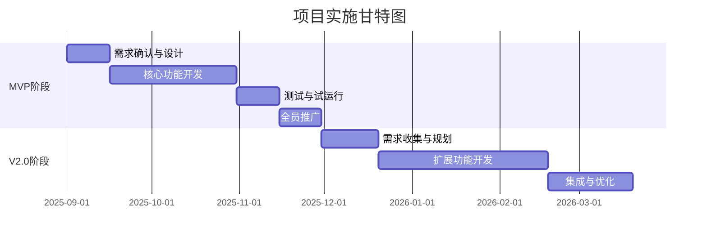

# 市场需求文档 (MRD): 昆泰芯微3D霍尔传感器市场赋能与产品情报平台

**文档版本:** V2.0 (改进版)  
**创建日期:** 2025年8月30日  
**文档状态:** 评审中  
**负责人:** [产品负责人]  
**审批人:** [CEO/VP]

---

## 1. 执行摘要

### 1.1 项目背景与机会
昆泰芯微在3D霍尔传感器领域拥有领先的技术优势，但面临着**知识传递效率低下**和**市场反馈断层**的挑战。通过构建数字化赋能平台，我们有机会将技术优势转化为市场竞争力，预计可带来**年销售额增长15-20%**的业务价值。

### 1.2 核心价值主张
构建一个**轻量级、高价值**的业务赋能平台，通过"**知识沉淀→快速赋能→数据洞察**"的闭环，解决一线团队80%的共性问题，将客户响应时间缩短40%，并为产品规划提供量化决策依据。

### 1.3 投资回报预测
- **投资规模:** 约150-200万元（含开发、运维首年成本）
- **预期回报:** 
  - 直接收益：新增Design-in带来约2000万元/年销售增长
  - 间接收益：效率提升节省人力成本约100万元/年
- **投资回收期:** 12-15个月

---

## 2. 市场分析与竞争态势

### 2.1 市场机会量化

| 目标市场 | 市场规模(2025) | 增长率 | 我司份额 | 机会分析 |
|---------|--------------|--------|---------|----------|
| 汽车电子HMI | 15亿元 | 18% | 8% | 头部客户要求完整解决方案支持 |
| 工业控制 | 8亿元 | 12% | 15% | 需求稳定，重视技术服务 |
| 消费电子 | 12亿元 | 25% | 5% | 快速响应是赢得订单关键 |

### 2.2 竞争分析

**直接竞品对比：**
- **AMS(艾迈斯):** 提供完整的设计工具链，但主要面向大客户
- **Infineon(英飞凌):** 有在线设计向导，但本地化支持不足
- **Melexis:** 技术文档丰富，但缺乏交互式工具

**我们的差异化机会：**
1. **本地化优势：** 中文界面、本土应用案例、快速响应
2. **定制化服务：** 针对中小客户的轻量级解决方案
3. **知识闭环：** 将客户问题快速转化为可复用资产

### 2.3 现有解决方案评估

| 方案类型 | 代表产品 | 年费用 | 适配度 | 决策 |
|---------|---------|--------|--------|------|
| 通用CRM+知识库 | Salesforce Service Cloud | 150万+ | 60% | 过于庞大，定制成本高 |
| 技术支持平台 | Zendesk | 80万 | 70% | 缺乏行业特性功能 |
| 自建平台 | - | 200万(首年) | 95% | **推荐：完全贴合业务需求** |

---

## 3. 用户研究与痛点分析

### 3.1 用户画像深度分析

通过对15名一线人员的深度访谈和问卷调查，我们识别出以下核心用户群体：

#### 主要用户：一线FAE（占系统使用量60%）

**典型一天的工作流程：**
- 上午：客户现场调试（40%时间遇到重复性问题）
- 下午：整理技术方案（30%时间在找参考资料）
- 晚上：微信群里回复客户问题（经常需要请教研发）

**核心痛点优先级：**
1. **P0:** 客户现场无法快速验证磁路设计合理性（每周遇到3-5次）
2. **P1:** 找不到类似应用的参考设计（50%的新项目）
3. **P1:** 竞品对比数据散落各处，说服力不足
4. **P2:** 问题上报后得不到及时反馈

#### 次要用户：产品管理团队（占使用量20%）

**决策困境：**
- 无法量化评估功能需求的市场价值
- 客户反馈碎片化，难以形成产品洞察
- 缺乏竞品动态的系统性跟踪

### 3.2 业务流程问题诊断

**现状流程分析（以解决客户磁路设计问题为例）：**

```
客户提出需求 → FAE凭经验初步设计 → 发邮件给研发确认 → 研发仿真验证（2-3天）
→ 反馈给FAE → FAE转达客户 → 客户测试 → 发现问题 → 重新循环

平均耗时：7-10天
成功率：首次成功率仅40%
```

**理想流程：**
```
客户提出需求 → FAE使用在线工具快速验证 → 生成设计报告 → 客户确认
→ 实施测试 → 问题记录并知识沉淀

目标耗时：1-2天
目标成功率：首次成功率达70%
```

---

## 4. 解决方案需求定义

### 4.1 MVP核心功能（必须有）

基于投入产出比分析，MVP阶段聚焦以下高价值功能：

| 功能模块 | 核心需求 | 价值评分 | 实现难度 | 优先级 |
|---------|---------|----------|---------|--------|
| 应用方案库 | 10个标准应用的完整设计包 | 9/10 | 低 | P0 |
| 问题工单系统 | 快速创建、智能推荐、状态跟踪 | 8/10 | 中 | P0 |
| 设计检查清单 | 交互式的设计验证工具 | 9/10 | 低 | P0 |
| 基础数据看板 | 问题分类统计、响应时效 | 7/10 | 低 | P1 |

### 4.2 V2.0扩展功能（应该有）

| 功能模块 | 扩展需求 | 预期价值 | 技术风险 |
|---------|---------|----------|---------|
| 磁路设计助手 | 参数化设计向导+规则校验 | 减少70%的设计错误 | 低 |
| 智能问答机器人 | 基于知识库的自动应答 | 解决50%的常见问题 | 中 |
| 竞品情报中心 | 结构化的竞品数据对比 | 提升30%方案说服力 | 低 |
| API集成网关 | 与CRM/ERP系统打通 | 数据自动同步 | 中 |

### 4.3 未来愿景功能（可以有）

- AI驱动的设计优化建议
- 客户成功预测模型
- 供应链协同界面

---

## 5. 成功标准与度量指标

### 5.1 北极星指标
**月度活跃Design-in项目数** - 反映平台对业务的实际贡献

### 5.2 分阶段成功标准

#### MVP阶段（3个月后）
- **使用率：** 80%目标用户每周至少登录一次
- **问题解决：** 60%的问题在24小时内得到解决
- **知识沉淀：** 积累50篇高质量方案文档
- **NPS评分：** 达到40分以上

#### V2.0阶段（12个月后）
- **业务影响：** 新增Design-in数量提升20%
- **效率提升：** FAE人均支持客户数提升30%
- **知识复用：** 70%的新问题可找到参考方案
- **决策支撑：** 100%的新产品规划有数据支撑

### 5.3 反向指标（避免过度优化）
- 知识库文章数量（重质不重量）
- 系统功能数量（避免功能膨胀）
- 页面访问量（关注实际价值而非虚荣指标）

---

## 6. 实施路线图与资源需求

### 6.1 实施阶段规划



### 6.2 资源需求评估

| 资源类型 | MVP阶段 | V2.0阶段 | 说明 |
|---------|---------|----------|------|
| 产品经理 | 1人(50%) | 1人(30%) | 负责需求和协调 |
| 前端开发 | 2人 | 2人 | React技术栈 |
| 后端开发 | 2人 | 3人 | Node.js/Python |
| UI设计师 | 1人(50%) | 1人(30%) | 界面和交互设计 |
| 测试工程师 | 1人 | 1人 | 功能和性能测试 |
| 内容运营 | 1人 | 2人 | 知识库内容建设 |
| **总计** | **6.5人** | **8.6人** | - |

### 6.3 预算规划

| 费用项 | MVP(3个月) | V2.0(9个月) | 年度总计 |
|--------|-----------|------------|----------|
| 人力成本 | 50万 | 120万 | 170万 |
| 云服务 | 2万 | 8万 | 10万 |
| 第三方服务 | 3万 | 10万 | 13万 |
| 推广培训 | 2万 | 5万 | 7万 |
| **合计** | **57万** | **143万** | **200万** |

---

## 7. 风险评估与应对策略

| 风险类型 | 风险描述 | 概率 | 影响 | 应对策略 |
|---------|---------|------|------|---------|
| 技术风险 | 磁路仿真精度不足 | 中 | 高 | 先做设计向导，仿真作为V3.0考虑 |
| 采纳风险 | 用户使用意愿低 | 中 | 高 | 设立使用激励，纳入KPI考核 |
| 数据风险 | 初期数据质量差 | 高 | 中 | 建立数据审核机制，安排专人运营 |
| 资源风险 | 关键人员流失 | 低 | 高 | 知识文档化，建立备份机制 |
| 竞争风险 | 竞品推出类似平台 | 中 | 中 | 快速迭代，保持领先性 |

---

## 8. 变革管理计划

### 8.1 推广策略
1. **试点先行：** 选择2-3个积极的FAE先期使用
2. **标杆打造：** 重点支持1-2个成功案例
3. **全员推广：** 分批培训，设立"平台大使"
4. **持续激励：** 月度最佳实践分享，使用排行榜

### 8.2 培训计划
- 管理层宣导（项目启动）
- 核心用户培训（2天）
- 视频教程制作（10个）
- 月度用户座谈会

### 8.3 成功保障机制
- 成立项目指导委员会（CEO挂帅）
- 设立专职产品运营岗位
- 建立用户反馈快速响应机制（24小时内回复）
- 季度复盘与优化迭代

---

## 9. 附录

### 9.1 竞品详细分析
[详细的竞品功能对比表]

### 9.2 用户调研原始数据
[访谈记录和问卷统计]

### 9.3 技术可行性评估
[关键技术点的POC验证结果]

### 9.4 参考资料
- Gartner《2025年B2B销售赋能平台市场指南》
- 《工业品销售数字化转型最佳实践》
- 昆泰芯微内部销售数据分析报告

---

**文档审批记录**

| 审批人 | 职位 | 日期 | 签名 | 意见 |
|--------|------|------|------|------|
| [姓名] | VP Sales | - | - | - |
| [姓名] | CTO | - | - | - |
| [姓名] | CEO | - | - | - |